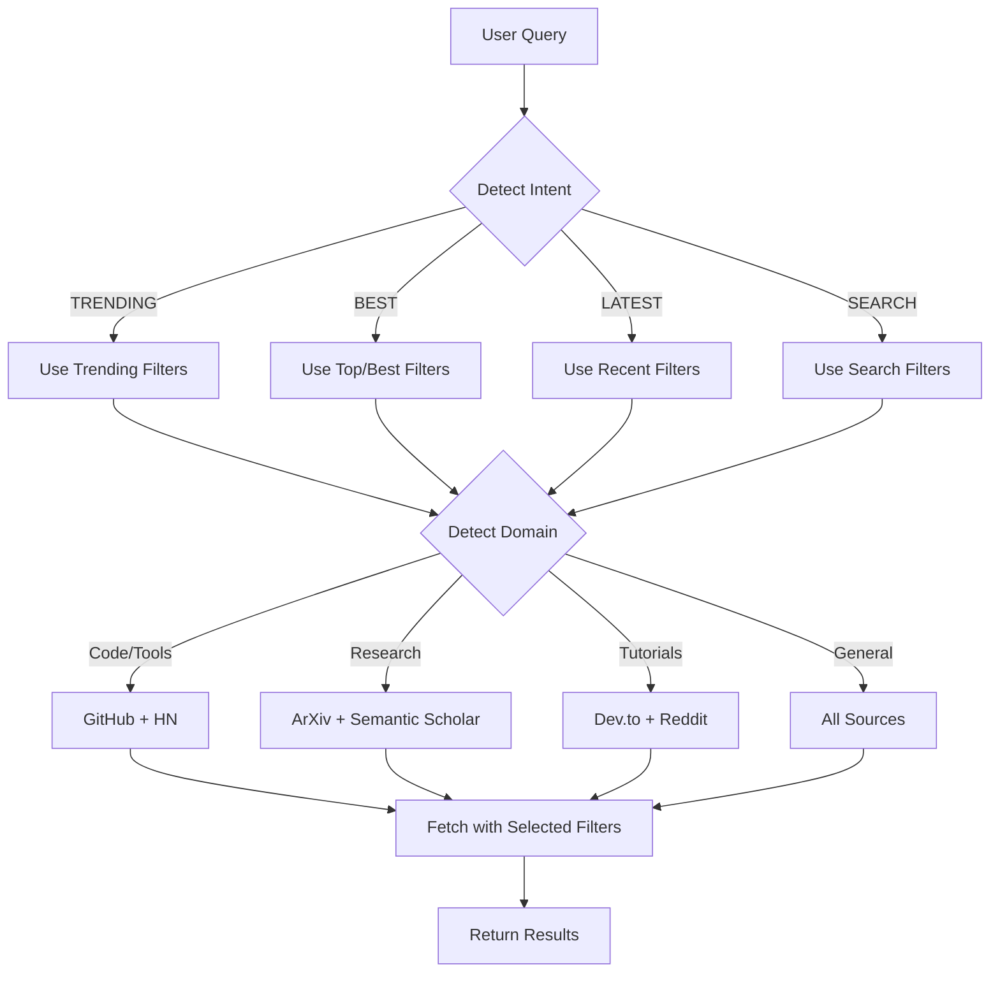

# Intelligent Signal Filtering Strategy
> *Palantir-Level Intelligence Architecture*

---

## I. THE CORE INSIGHT

**Problem**: Different queries need different filters
- "What's trending?" → Use trending filters
- "Best Redis alternatives?" → Use top/best filters  
- "Latest AI research?" → Use recent/new filters
- "Rust async tutorials?" → Use search filters

**Solution**: **Query-Aware Filter Selection**

---

## II. FILTER TAXONOMY BY SOURCE

### GitHub

| Filter | API Endpoint | Use Case |
| :--- | :--- | :--- |
| **Trending** | `/trending?since=weekly` | "What's hot in Python?" |
| **Top Starred** | `/search?q=stars:>1000&sort=stars` | "Best React libraries" |
| **Recently Created** | `/search?q=created:>2026-01-11` | "New AI tools" |
| **Most Forked** | `/search?q=forks:>100&sort=forks` | "Most used frameworks" |
| **Search** | `/search?q=redis+alternative` | "Redis alternatives" |

### HackerNews

| Filter | API Endpoint | Use Case |
| :--- | :--- | :--- |
| **Top Stories** | `/topstories.json` | "What's trending on HN?" |
| **Best Stories** | `/beststories.json` | "Best HN discussions" |
| **New Stories** | `/newstories.json` | "Latest HN posts" |
| **Search** | `hn.algolia.com/api/v1/search?query=X` | "HN posts about Redis" |
| **Ask HN** | `search?tags=ask_hn` | "Ask HN about auth" |

### ArXiv

| Filter | API Endpoint | Use Case |
| :--- | :--- | :--- |
| **Recent** | `sortBy=submittedDate&sortOrder=desc` | "Latest AI papers" |
| **Most Cited** | Via Semantic Scholar API | "Top AI papers" |
| **Search** | `search_query=all:reasoning` | "Papers on reasoning" |
| **Category** | `cat:cs.AI` | "AI papers only" |

### Dev.to

| Filter | API Endpoint | Use Case |
| :--- | :--- | :--- |
| **Top (Week)** | `/articles?top=7` | "Trending this week" |
| **Top (Month)** | `/articles?top=30` | "Best this month" |
| **Latest** | `/articles?per_page=20` | "New articles" |
| **Search** | `/articles?tag=react` | "React articles" |

### Reddit

| Filter | API Endpoint | Use Case |
| :--- | :--- | :--- |
| **Hot** | `/r/programming/hot.json` | "What's hot now?" |
| **Top (Day)** | `/top.json?t=day` | "Best today" |
| **Top (Week)** | `/top.json?t=week` | "Best this week" |
| **New** | `/new.json` | "Latest posts" |
| **Search** | `/search.json?q=redis` | "Posts about Redis" |

---

## III. QUERY CLASSIFICATION SYSTEM

### Intent Detection

```python
class QueryIntent:
    TRENDING = "trending"      # "What's hot/trending/popular?"
    BEST = "best"              # "Best/top X?"
    LATEST = "latest"          # "New/recent/latest X?"
    SEARCH = "search"          # "Find X", "X alternatives"
    COMPARISON = "comparison"  # "X vs Y"
```

### Classification Rules

| Query Pattern | Intent | Filter |
| :--- | :--- | :--- |
| "trending", "hot", "popular" | TRENDING | trending, hot |
| "best", "top", "recommended" | BEST | top, best, most starred |
| "new", "latest", "recent" | LATEST | recent, new |
| "find", "search", "about" | SEARCH | search |
| "vs", "alternative", "instead" | COMPARISON | search + filter |

---

## IV. SMART FILTER SELECTION LOGIC

### The Decision Tree



---

## V. IMPLEMENTATION ARCHITECTURE

### Core Components

```python
# 1. Query Analyzer
class QueryAnalyzer:
    def analyze(self, query: str) -> QueryContext:
        """
        Analyze query to determine:
        - Intent (trending, best, latest, search)
        - Domain (code, research, tutorials)
        - Keywords (redis, auth, llm)
        - Time window (today, week, month)
        """
        pass

# 2. Filter Selector
class FilterSelector:
    def select_filters(self, context: QueryContext) -> FilterConfig:
        """
        Select optimal filters for each source based on query context.
        
        Returns:
            FilterConfig with source-specific filters
        """
        pass

# 3. Multi-Source Fetcher
class IntelligenceFetcher:
    async def fetch(self, filter_config: FilterConfig) -> list[Signal]:
        """
        Fetch from all sources using selected filters in parallel.
        """
        pass
```

### Example Flow

```python
# User query: "What's trending in AI agents?"

# Step 1: Analyze
context = QueryAnalyzer().analyze("What's trending in AI agents?")
# → Intent: TRENDING
# → Domain: code + research
# → Keywords: ['ai', 'agents']
# → Time: week

# Step 2: Select filters
filters = FilterSelector().select_filters(context)
# → GitHub: trending?since=weekly + search for "ai agents"
# → HN: topstories + filter by keywords
# → ArXiv: recent papers + search for "agents"
# → Dev.to: top=7 + tag=ai

# Step 3: Fetch
signals = await IntelligenceFetcher().fetch(filters)
# → Returns 10 trending signals about AI agents
```

---

## VI. FILTER CONFIGURATION SCHEMA

```python
@dataclass
class FilterConfig:
    """Configuration for fetching from all sources."""
    
    github: GitHubFilter
    hackernews: HNFilter
    arxiv: ArXivFilter
    devto: DevToFilter
    reddit: RedditFilter

@dataclass
class GitHubFilter:
    mode: str  # "trending", "top", "recent", "search"
    since: str = "weekly"  # for trending
    sort: str = "stars"    # for search
    query: str = None      # for search
    language: str = None

@dataclass
class HNFilter:
    mode: str  # "top", "best", "new", "search"
    query: str = None
    tags: list[str] = None

@dataclass
class ArXivFilter:
    mode: str  # "recent", "search"
    categories: str = "cs.AI+cs.LG+cs.CL"
    query: str = None
    days: int = 7
```

---

## VII. QUERY EXAMPLES & FILTER MAPPING

| User Query | Intent | GitHub Filter | HN Filter | ArXiv Filter |
| :--- | :--- | :--- | :--- | :--- |
| "What's trending in Python?" | TRENDING | trending, lang=python | topstories | recent |
| "Best Redis alternatives" | BEST | search, sort=stars | search "redis" | N/A |
| "Latest AI research" | LATEST | N/A | N/A | recent, 7 days |
| "New React libraries" | LATEST | recent, lang=js | newstories | N/A |
| "Top LLM papers" | BEST | N/A | N/A | most cited |
| "Rust async tutorials" | SEARCH | search "rust async" | search | N/A |

---

## VIII. IMPLEMENTATION ROADMAP

### Phase 1: Query Analysis (Week 1)
- [ ] Build `QueryAnalyzer` with intent detection
- [ ] Add keyword extraction
- [ ] Add domain classification
- [ ] Test with 50 sample queries

### Phase 2: Filter Selection (Week 1)
- [ ] Build `FilterSelector` with decision tree
- [ ] Map intents to filters for each source
- [ ] Add time window detection (today, week, month)
- [ ] Test filter selection accuracy

### Phase 3: Multi-Source Fetcher (Week 2)
- [ ] Implement GitHub filters (trending, top, recent, search)
- [ ] Implement HN filters (top, best, new, search)
- [ ] Implement ArXiv filters (recent, search)
- [ ] Implement Dev.to filters (top, latest)
- [ ] Add Reddit filters (hot, top, new)

### Phase 4: Integration (Week 2)
- [ ] Connect QueryAnalyzer → FilterSelector → Fetcher
- [ ] Add caching layer (1-hour TTL)
- [ ] Add fallback logic (if one source fails)
- [ ] End-to-end testing

### Phase 5: Optimization (Week 3)
- [ ] A/B test filter selection accuracy
- [ ] Optimize parallel fetching
- [ ] Add query suggestions
- [ ] Monitor API rate limits

---

## IX. CRITICAL DESIGN DECISIONS

### 1. **Intent Detection Method**

**Option A**: Rule-based (keywords)
```python
if "trending" in query or "hot" in query:
    intent = TRENDING
```
**Pros**: Fast, predictable
**Cons**: Limited accuracy

**Option B**: LLM-based
```python
intent = await llm.classify_intent(query)
```
**Pros**: High accuracy
**Cons**: Costs $0.0001 per query

**Decision**: **Hybrid** - Use rules first, LLM for ambiguous cases

---

### 2. **Filter Priority**

When multiple filters match, which to use?

**Priority Order**:
1. Trending (if intent = TRENDING)
2. Search (if specific keywords)
3. Top (if intent = BEST)
4. Recent (fallback)

---

### 3. **Source Selection**

Not all sources are relevant for all queries.

**Rules**:
- Code/tools → GitHub + HN
- Research → ArXiv + Semantic Scholar
- Tutorials → Dev.to + Reddit
- General → All sources

---

## X. SUCCESS METRICS

| Metric | Target | Measurement |
| :--- | :--- | :--- |
| **Intent accuracy** | >90% | Manual review of 100 queries |
| **Filter relevance** | >85% | User feedback |
| **Response time** | <3s | P95 latency |
| **API cost** | <$1/month | Track API calls |
| **User satisfaction** | >80% | "Was this helpful?" |

---

## XI. EXAMPLE IMPLEMENTATION

```python
# User query: "What are the best Redis alternatives?"

# Step 1: Analyze
context = QueryAnalyzer().analyze("What are the best Redis alternatives?")
# Intent: BEST
# Domain: code
# Keywords: ['redis', 'alternatives']

# Step 2: Select filters
filters = FilterSelector().select_filters(context)
# GitHub: search "redis alternative", sort=stars
# HN: search "redis alternative", sort=points
# ArXiv: skip (not research)
# Dev.to: search tag=redis

# Step 3: Fetch
signals = await IntelligenceFetcher().fetch(filters)
# Results:
# 1. Dragonfly (GitHub, 12K stars)
# 2. KeyDB (GitHub, 8K stars)
# 3. "Ask HN: Redis alternatives?" (HN, 150 points)
# 4. "Migrating from Redis to Dragonfly" (Dev.to)

# Step 4: Format for LLM
context = format_signals_for_context(signals)

# Step 5: Answer
answer = await llm.answer(query, context)
# "Based on trending signals, consider Dragonfly (12K stars, 
#  5x faster) or KeyDB (multithreaded fork)..."
```

---

**End of Strategic Plan // Side Alpha-0**
