# Side MVP Intelligence Pipeline
> *Strategic, Cheap, Focused // January 2026*

---

## I. THE COST REALITY CHECK

### LLM Scoring is NOT Cheap at Scale

| Operation | Volume | Cost (Groq) |
| :--- | :--- | :--- |
| Score 200 articles (titles only) | 5K tokens | $0.0005 |
| Score 200 articles (with summaries) | 50K tokens | $0.005 |
| Score 200 articles (full text) | 500K tokens | $0.05 |

**Monthly at full text**: $0.05/day × 30 = **$1.50/month**

**But**: This assumes we process EVERYTHING. That's wasteful.

---

## II. THE MVP STRATEGY: TEXT ANALYSIS FIRST

### Phase 1: Cheap Filtering (FREE)

```python
# Cost: $0.00
def filter_by_keywords(articles: list) -> list:
    """
    Filter 200 articles down to 20 using simple keyword matching.
    
    High-value keywords by use case:
    - Competition: "alternative to", "vs", "comparison", "better than"
    - Open Source: "github.com", "open source", "MIT license", "Apache"
    - LLM Research: "reasoning", "benchmark", "GPT", "Llama", "SOTA"
    """
    strategic_keywords = {
        'competition': ['alternative', 'vs', 'comparison', 'competitor'],
        'open_source': ['github', 'open source', 'fork', 'stars'],
        'llm_research': ['reasoning', 'benchmark', 'gpt', 'llama', 'chain-of-thought']
    }
    
    filtered = []
    for article in articles:
        text = f"{article['title']} {article.get('description', '')}".lower()
        
        # Check if ANY strategic keyword matches
        for category, keywords in strategic_keywords.items():
            if any(kw in text for kw in keywords):
                article['category'] = category
                filtered.append(article)
                break
    
    return filtered[:20]  # Top 20 only
```

**Result**: 200 articles → 20 strategic articles (90% reduction, $0 cost)

### Phase 2: LLM Scoring (CHEAP)

```python
# Cost: $0.001 (20 articles instead of 200)
scores = await llm.score_batch(filtered_20_articles)
top_10 = sorted(scores, key=lambda x: x['score'], reverse=True)[:10]
```

**Total cost**: $0.001/day × 30 = **$0.03/month**

---

## III. WHAT TO STORE (METADATA ONLY)

### ❌ DON'T Store:
- Full article text (expensive, unnecessary)
- Full transcripts (defer to post-investment)
- Raw HTML (wasteful)

### ✅ DO Store:

```sql
CREATE TABLE intelligence_signals (
    id TEXT PRIMARY KEY,
    title TEXT NOT NULL,              -- "Dragonfly: Redis Alternative 5x Faster"
    url TEXT UNIQUE,                  -- Link to original
    source TEXT,                      -- 'hn', 'arxiv', 'github'
    category TEXT,                    -- 'competition', 'open_source', 'llm_research'
    keywords JSON,                    -- ['redis', 'alternative', 'performance']
    one_line_summary TEXT,            -- "Drop-in Redis replacement, 5x faster"
    score INTEGER,                    -- 85
    published_at TIMESTAMP,
    expires_at TIMESTAMP              -- 30 days from now
);
```

**Storage per signal**: ~500 bytes
**Total for 10/day × 30 days**: 150KB

---

## IV. THE THREE MVP USE CASES

### Use Case 1: Competition Tracking

**Goal**: Know what alternatives exist for any tool

**Example**:
```
User: "Side, what are alternatives to Supabase?"

Pipeline:
1. Query: SELECT * FROM intelligence_signals 
   WHERE keywords LIKE '%supabase%' OR keywords LIKE '%alternative%'
2. Results: 5 signals from last 30 days
3. LLM: "Based on recent discussions, consider Pocketbase (Go-based, 
   single binary) or Appwrite (self-hosted, Docker)."
```

**Data needed**:
- HN "Ask HN: X alternatives" threads
- GitHub repos with "alternative to X" in README
- Dev.to comparison articles

### Use Case 2: Open Source Alternatives

**Goal**: Suggest OSS instead of paid tools

**Example**:
```
User is writing: import stripe

Side: "💡 FYI: Polar (OSS Stripe alternative) is trending. 
Consider for self-hosted billing."
```

**Data needed**:
- GitHub trending repos
- HN "Show HN" posts
- ArXiv papers on open implementations

### Use Case 3: LLM Research → Algorithm Improvements

**Goal**: Improve Side's own intelligence using latest research

**Example**:
```
Internal process (weekly):
1. Fetch: Top 10 ArXiv papers on "reasoning", "planning", "agents"
2. Extract: Novel techniques (e.g., "Chain-of-Thought without prompting")
3. Store: One-line summary + link
4. Action: Update Side's prompt engineering based on findings
```

**Data needed**:
- ArXiv cs.AI, cs.LG, cs.CL
- Papers with >10 citations
- Keywords: "reasoning", "planning", "tool use", "agents"

---

## V. THE MVP PIPELINE (Step by Step)

### Daily Process

```mermaid
graph TD
    A[Fetch 200 articles from RSS] --> B[Text Analysis: Filter to 20]
    B --> C[LLM: Score 20 → Top 10]
    C --> D[Extract: Title, URL, Keywords, One-liner]
    D --> E[Store: Metadata only]
    E --> F[Expire: After 30 days]
```



### Cost Breakdown

| Step | Cost |
| :--- | :--- |
| Fetch 200 articles | Free (RSS) |
| Text analysis (keyword filter) | Free (regex) |
| LLM score 20 articles | $0.001 |
| Store 10 signals | Free (SQLite) |
| **Total per day** | **$0.001** |
| **Total per month** | **$0.03** |

---

## VI. TEXT ANALYSIS PIPELINE (Pre-LLM)

### Step 1: Keyword Extraction (Free)

```python
import re
from collections import Counter

def extract_strategic_keywords(text: str) -> list[str]:
    """
    Extract keywords that indicate strategic value.
    
    Returns: ['redis', 'alternative', 'performance', 'open-source']
    """
    # Remove common words
    stop_words = {
        'the', 'a', 'an', 'in', 'on', 'at', 'for', 'to', 'of', 'and', 
        'is', 'it', 'this', 'that', 'with', 'from', 'by'
    }
    
    # Extract words (4+ chars)
    words = re.findall(r'\b[a-zA-Z]{4,}\b', text.lower())
    filtered = [w for w in words if w not in stop_words]
    
    # Get top 5 most common
    return [word for word, _ in Counter(filtered).most_common(5)]
```

### Step 2: Category Detection (Free)

```python
def detect_category(title: str, description: str) -> str:
    """
    Categorize article based on strategic keywords.
    
    Returns: 'competition', 'open_source', 'llm_research', or None
    """
    text = f"{title} {description}".lower()
    
    # Competition signals
    if any(kw in text for kw in ['alternative', 'vs', 'comparison', 'better than', 'instead of']):
        return 'competition'
    
    # Open source signals
    if any(kw in text for kw in ['github', 'open source', 'oss', 'mit license', 'apache']):
        return 'open_source'
    
    # LLM research signals
    if any(kw in text for kw in ['reasoning', 'benchmark', 'gpt', 'llama', 'chain-of-thought', 'sota']):
        return 'llm_research'
    
    return None  # Discard
```

### Step 3: One-Line Summary (Free)

```python
def extract_one_liner(title: str, description: str) -> str:
    """
    Extract a one-line summary from title + first sentence.
    
    Returns: "Drop-in Redis replacement, 5x faster, multithreaded"
    """
    # Use title if descriptive
    if len(title) > 30 and len(title) < 100:
        return title
    
    # Otherwise, use first sentence of description
    if description:
        first_sentence = description.split('.')[0].strip()
        if len(first_sentence) > 20:
            return first_sentence[:150]
    
    return title[:150]
```

---

## VII. IMPLEMENTATION PRIORITY

### Week 1: Foundation (MVP)
- [x] Add `intelligence_signals` table
- [ ] Implement text analysis pipeline (keyword extraction, category detection)
- [ ] Add simple keyword-based filtering (200 → 20)
- [ ] Test: Can we filter ArXiv papers to top 10 LLM research?

### Week 2: LLM Integration
- [ ] Add LLM batch scoring for filtered 20 articles
- [ ] Store top 10 with metadata only
- [ ] Test: Query "alternatives to Redis" → retrieve signals

### Week 3: Use Case 1 (Competition Tracking)
- [ ] Build retrieval function for competition queries
- [ ] Test: "Side, what are Supabase alternatives?"
- [ ] Measure: Does LLM give better answers with signal context?

### Week 4: Use Case 2 (Open Source Suggestions)
- [ ] Detect when user imports paid tools
- [ ] Suggest OSS alternatives from signals
- [ ] Test: User types `import stripe` → suggest Polar

---

## VIII. THE VISION: KNOWLEDGE BASE FOR HUMANS + LLMs

### For Humans (in Cursor/IDEs):
```
Developer working on auth code:
Side: "💡 3 new auth libraries trending this week:
  1. Lucia (lightweight, TypeScript)
  2. Better Auth (Drizzle integration)
  3. Arctic (OAuth library by Lucia author)
  
  Based on your stack (Next.js + Postgres), consider Better Auth."
```

### For LLMs (RAG Context):
```
User: "Side, how should I handle auth in my Next.js app?"

Context injected to LLM:
- Signal 1: "Better Auth trending, Drizzle integration"
- Signal 2: "Lucia v3 released, breaking changes"
- Signal 3: "NextAuth.js rebranded to Auth.js"

LLM: "Based on recent developments, Auth.js (formerly NextAuth) 
is the most mature option, but Better Auth is gaining traction 
for its Drizzle integration..."
```

---

## IX. SUCCESS METRICS (MVP)

| Metric | Target | Measurement |
| :--- | :--- | :--- |
| **Cost efficiency** | <$0.10/month | Track LLM API costs |
| **Signal quality** | >80% relevant | Manual review of top 10 |
| **Storage efficiency** | <1MB total | Check DB size |
| **Retrieval speed** | <100ms | Query performance |
| **User value** | 1 useful suggestion/day | User feedback |

---

## X. THE MVP MANTRA

> **"Tiny, helpful, step by step"**

- ✅ Start with 3 use cases, not 30
- ✅ Store metadata, not full text
- ✅ Filter with text analysis, score with LLM
- ✅ Cost: $0.03/month, not $30/month
- ✅ Build for developers in IDEs, not general consumers

---

**End of MVP Strategy // Side Alpha-0**
